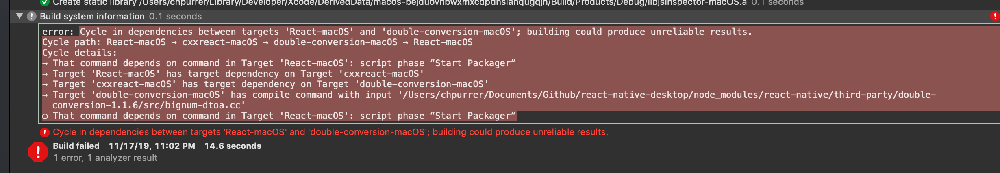
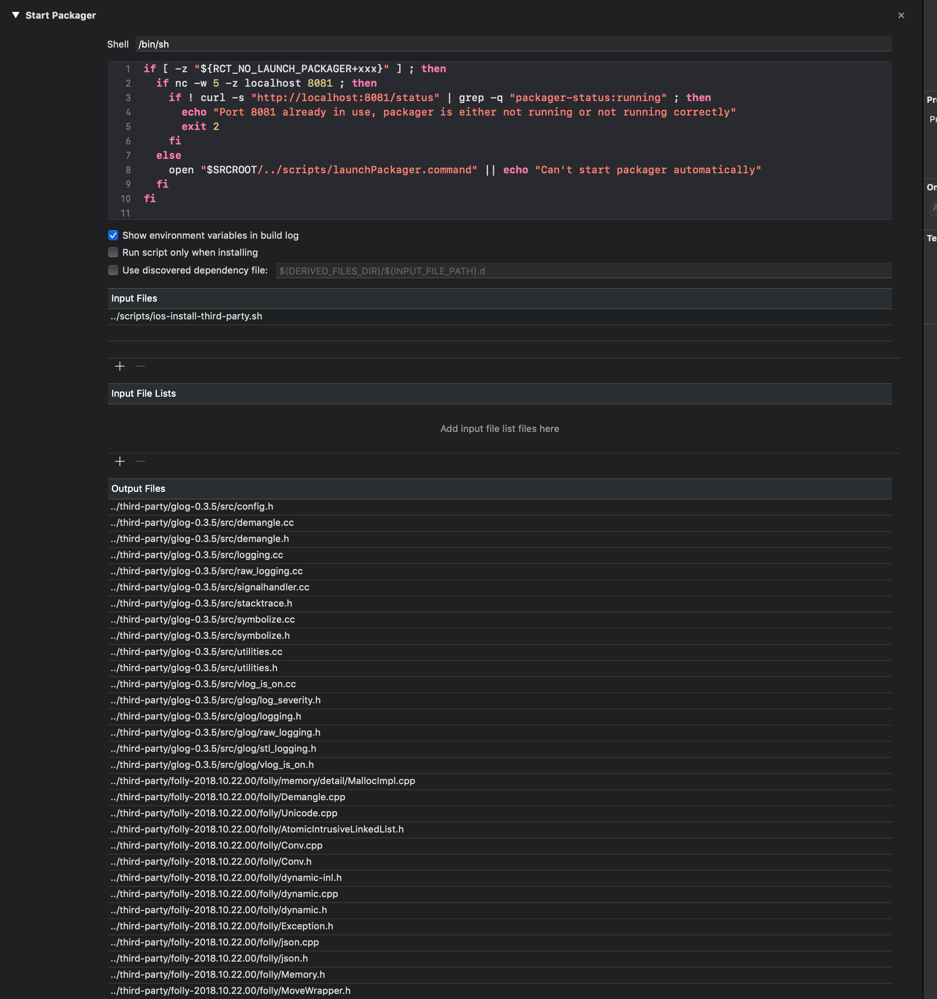
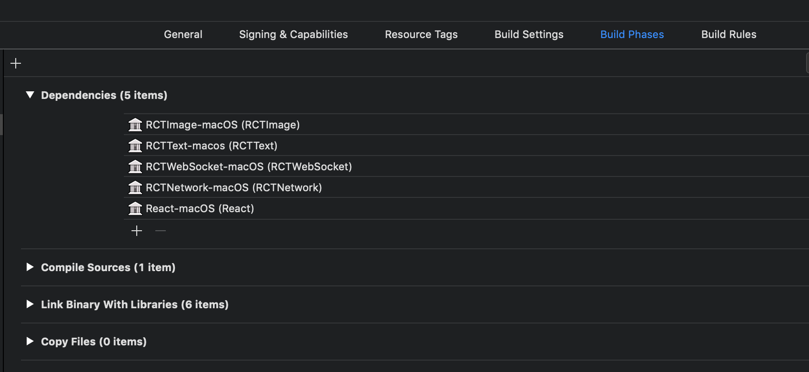
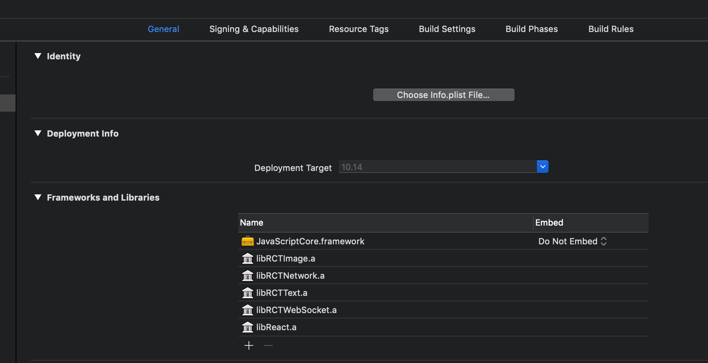

# react-native-desktop
Sample using react-native on macOS and Windows

## Start

To clone and run this repository you'll need [Git](https://git-scm.com), [Node.js](https://nodejs.org/en/download/) (which comes with [npm](http://npmjs.com)) installed on your computer. 

From your command line:

```bash
# Clone this repository
git clone https://github.com/christophpurrer/react-native-desktop.git
# Go into the repository
cd react-native-desktop
# Install dependencies
yarn install
# Download third party source code for macOS
node_modules/react-native/scripts/ios-install-third-party.sh 
# start Metro
yarn start
```
Now open the Project in XCode ....

Trying you build with a cyclic dependency error:

Delete the 'Start Packager' section from 'Build  phases' in the 'macos' target

Optional check dependencies ...

